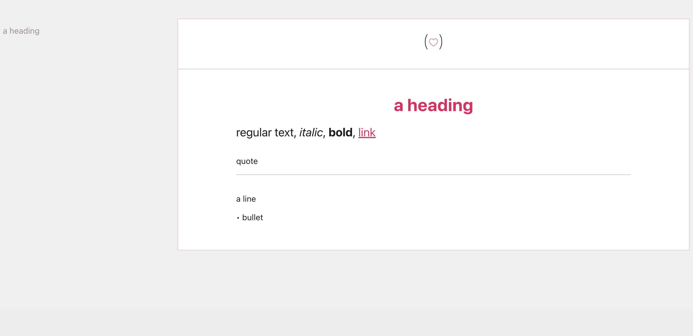

# Markdown-Compiler
A minimal markdown compiler for my personal website, written in C in a Handmade
style. 

So this:
```
# a heading
regular text, _italic_, **bold**, [link](https://handmade.network.com) 
> quote
---
a line
- bullet 
```

Becomes this:


[Full dev log here](https://sethdetroit.com/series/markdown-to-html-compiler-in-c.html) (Yes, that site is created using this.)

Not really recommended for public use, but if you're adventurous go
ahead.. Also if you make something better let me know!

# Setup on MacOS

This will: 

- Generate the folder structure
- Create a sample file
- Download the compiler
- Build the website
- Open the webite
- Open the example file

```
mkdir my_website
cd my_website
mkdir -p public/series
mkdir -p html_generator/series
cp example_markdown/example-blog.txt > html_generator/series/example-blog.txt
git clone git@github.com:SethArchambault/Markdown-Compiler.git
cd Markdown-Compiler
./build.sh
cd ..
open Markdown-Compiler/series/articles.h
open public/series/example-blog-url.html
open html_generator/series/example-blog.txt
```

# Mental Model

- Articles go in: html_generator/series
- And come out:  public/series
- Each new file will need a line in Markdown-Compiler/series/articles.h

# Notes

- Notice that h1 tags `#` will have navigation that shows up in the sidebar.
- This is assuming your server is pointing at the public folder, and that you've got an index there that links to some of the pages in the series folder. Don't ask me why it's called series, I don't remember.
- Don't be afraid to check out the debug folder, this will contain the nodes and tokens generated by the compiler for your file, which is actually pretty easy to read.

# Interesting Files

- templates/single_header.chtml - header
- templates/single_footer.chtml - footer
- series/articles.h - index of all articles to be processed
- main.c - where memory is allocated, and some maxes are set.

# Troubleshooting - Mini LLDB Tutorial

If something crashes, see if the line it crashed on was an assert, this could hint that more memory needs to be allocated or MAXes increased in main.

You can also try using lldb, check the backtrace and select a frame that looks suspicious, and then print the variables there to give more clues.

Here's an example:

```
main.c:52:5: error: Assert failed: len < max
UndefinedBehaviorSanitizer:DEADLYSIGNAL
==53143==ERROR: UndefinedBehaviorSanitizer: SEGV on unknown address 0x000000000000 (pc 0x00010067abec bp 0x00016f796cc0 sp 0x00016f796c50 T849714)
==53143==The signal is caused by a WRITE memory access.
==53143==Hint: address points to the zero page.
    #0 0x10067abec in read_file main.c:52
    #1 0x10067ad8c in main main.c:63
    #2 0x192393f24  (<unknown module>)

... <removed register values> ...

UndefinedBehaviorSanitizer can not provide additional info.
SUMMARY: UndefinedBehaviorSanitizer: SEGV main.c:52 in read_file
==53143==ABORTING
./build.sh: line 7: 53143 Abort trap: 6           ./main
```

But looking at that line doesn't pin it down all the way since it's in a function:
```
void read_file(char * filename, char * buffer, int max) {
    FILE *f = fopen(filename, "r");
    assert(f);
    fseek(f, 0, SEEK_END);
    long len = ftell(f);
    assert(len < max); <--- 
    fseek(f, 0, SEEK_SET);
    fread(buffer, (unsigned long) len, 1, f);
    buffer[len] = '\0';
}
```

So we use lldb and use `run` to observing the crash: 

```
$ lldb main
(lldb) target create "main"
Current executable set to 'my_website/Markdown-Compiler/main' (arm64).
(lldb) run
Process 53813 launched: 'my_website/Markdown-Compiler/main' (arm64)

main.c:52:5: error: Assert failed: len < max
Process 53813 stopped
* thread #1, queue = 'com.apple.main-thread', stop reason = EXC_BAD_ACCESS (code=1, address=0x0)
    frame #0: 0x0000000100012bec main`read_file(filename="templates/single_header.chtml", buffer="", max=1) at main.c:52:5
   49       assert(f);
   50       fseek(f, 0, SEEK_END);
   51       long len = ftell(f);
-> 52       assert(len < max);
   53       fseek(f, 0, SEEK_SET);
   54       fread(buffer, (unsigned long) len, 1, f);
   55       buffer[len] = '\0';
Target 0: (main) stopped.
```

Okay, this shows us that we were running the `single_header` file, and that max was 1. This is a fake example, so yeah the problem is that `single_header` is longer than 1 character long, and we need to increaes the max. But let's go through the process anyways.

Let's check the variables using `var`:

```
(lldb) var
(char *) filename = 0x0000000100013a22 "templates/single_header.chtml"
(char *) buffer = 0x000000010002a290 ""
(int) max = 1
(FILE *) f = 0x00000001ede4a8a0
(long) len = 5935
```

Now we know that single_header has a byte length of 5935, so we are done with our investigation.
Often it's not so easy, and we might need to move up the backtrace (stack frame) with `bt` and select a frame with `f`.

```
(lldb) bt
* thread #1, queue = 'com.apple.main-thread', stop reason = EXC_BAD_ACCESS (code=1, address=0x0)
  * frame #0: 0x0000000100012bec main`read_file(filename="templates/single_header.chtml", buffer="", max=1) at main.c:52:5
    frame #1: 0x0000000100012d90 main`main at main.c:63:5
    frame #2: 0x0000000192393f28 dyld`start + 2236
(lldb) f 1
frame #1: 0x0000000100012d90 main`main at main.c:63:5
   60       char * memory = malloc(memory_allocated);
   61
   62       // templates
-> 63       read_file("templates/single_header.chtml", header, HEADER_MAX);
   64       read_file("templates/single_footer.chtml", footer, FOOTER_MAX);
   65
   66       // check out articles.h if you want to add new routes..
```

From there we can continue to get vars and move up the stack to locate enough info about the error.


[Casey Muratori - Compression Oriented Programming](https://caseymuratori.com/blog_0015)


